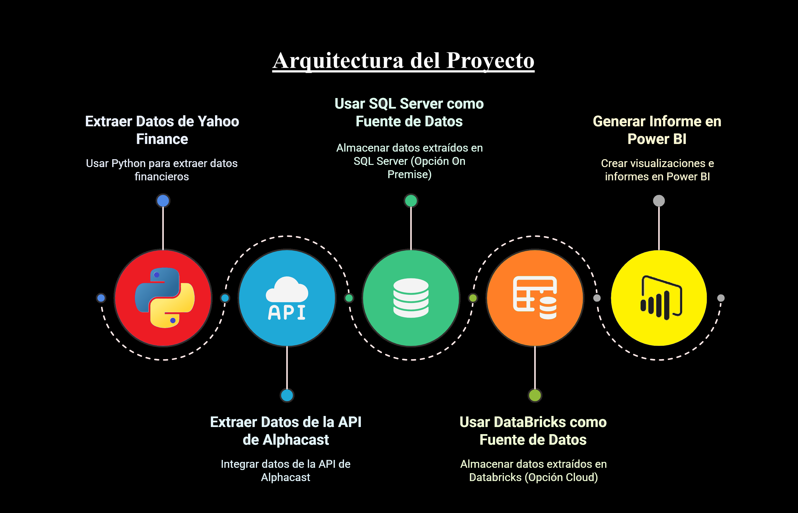
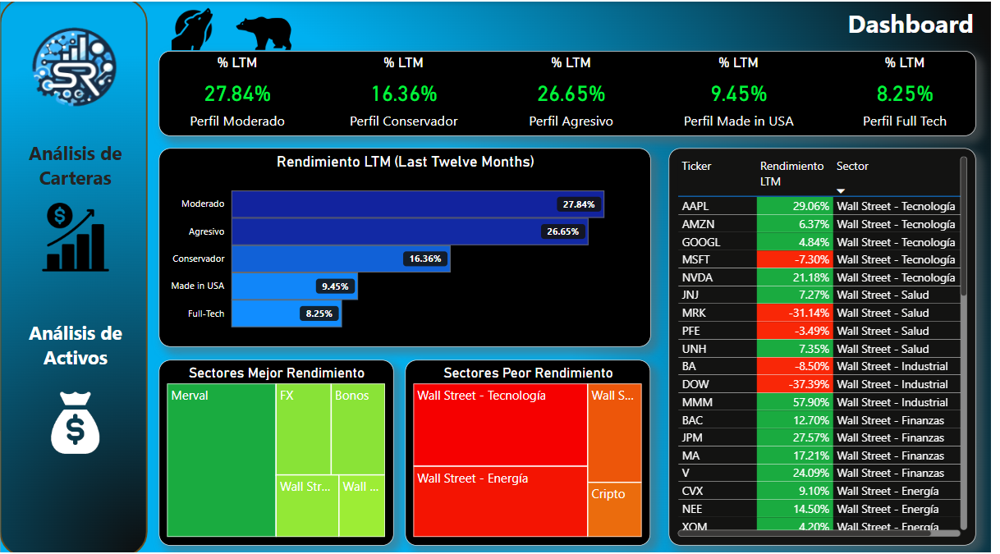
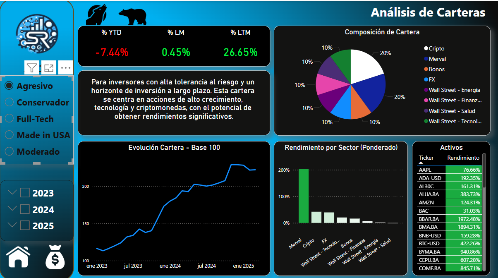
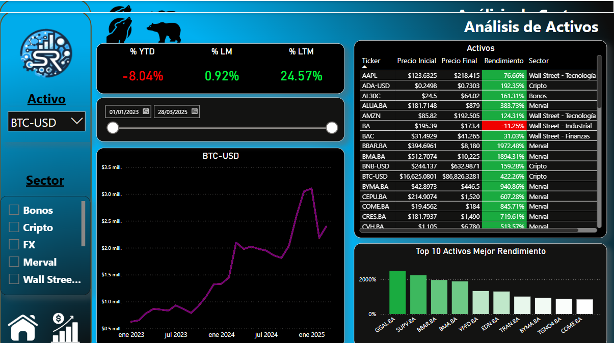

# 📊 Proyecto de BI Financiero: Comparación de Carteras de Inversión

## 📌 Descripción
Este proyecto de Business Intelligence (BI) financiero tiene como objetivo comparar el rendimiento de cinco carteras de inversión, analizando también el desempeño de los sectores y los activos que las componen. Se implementa en dos arquitecturas paralelas:

- **On-Premise:** Uso de Jupyter Notebooks con Python, almacenamiento en SQL Server y visualización en Power BI.
- **Cloud (Databricks):** Implementación en Databricks con conexión directa a Power BI.

## 🛠️ Herramientas Utilizadas
### 🔹 Análisis y Procesamiento de Datos:
- **Python** (con Jupyter Notebooks en la versión On-Premise y Databricks en la versión Cloud)
- **Librerías:** `yfinance`, `beautifulsoup4` (web scraping), `alphacast`

### 🔹 Almacenamiento de Datos:
- **On-Premise:** SQL Server
- **Cloud:** Databricks (almacenamiento en Delta Lake)

### 🔹 Visualización y Reporting:
- **Power BI** (conexión a SQL Server y Databricks)

## 📸 Capturas de Pantalla
### 🔍 Diagrama de Arquitectura

### 📊 Ejemplo de Dashboard en Power BI

### 📊 Análisis de Carteras y Activos

